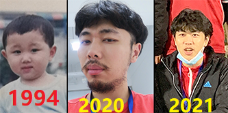

## Welcome: I'm Mincong Luo 

I am now a PhD candidate in [State Key Laboratory of Information Security](http://www.sklois.cn/), my major is **Computing Algebraic Geometry**.

This is the details of my research experience, with my research experience and papers, code, and handout details:

-------------------------------------------

My paper:
**Deterministic Encoding Into Generalized Huff Curves**
has been ACCEPTED by **The 22nd IEEE International Symposium on Information Theory(ISIT 2022)**(2022.06);

My paper:
**Traffic Route Planning in Partially Observable Enviroment Using Actions Group Representation**
has been ACCEPTED by **The 14th International Conference on Knowledge Science, Engineering and Management(KSEM 2021)**(2021.06);

My paper:
**Implementing Inductive Logic into Embedded Industrial Control System with Polynomial Ring on F2**
has been ACCEPTED by **2021 IEEE 45th Annual Computers, Software, and Applications Conference (COMPSAC)**(2021.05);

My paper:
**Fuzzy World:A Tool Training Agent from Concept Cognitive to Logic Inference**
has been ACCEPTED by **Pacific-Asia Conference on Knowledge Discovery and Data Mining 2021**(2021.02);

My new draft paper:
[Polynomial Semantic Representation](https://luomin1993.github.io/
Polynomial_Semantic_Representation.pdf)

My paper:
**Automatic Derivation of Formulas by Graph Embedding and Pattern Matching Network**
has been ACCEPTED as a SRC Program Paper by **34th ACM-SAC**(2018.12);

My paper:
**Generative Model for Material Experiments Based on Prior Knowledge and Attention Mechanism**
has been ACCEPTED as a workshop paper by **NIPS2018**(2018.11);

My paper:
**Orthogonal Policy Gradient and Autonomous Driving Application**
has been ACCEPTED by **IEEE/ICSESS**(2018.10);

-------------------------------------------
### Education Experience(我的教育經歷)

- China Academy of Atomic Energy(2016 - 2019):Master in Applied Mathematics;

- North China Electric Power University(211 Universities)(2012 - 2016):Bachelor in Nuclear Engineering;

-------------------------------------------
### Professional Experience(我的科研經歷)

-   CSA: PhD student(2019.9-NOW)

>My work in SKLOIS is about: Computing Algebraic Geometry (Algebraic method)
 

-   CSA: Intern Algorithm Researcher(2018.5-2019.05)

>My work in CSA motivated by:logical reasoning combined with vision and semantics (Neural-Symbolic AI)

-------------------------------------------
### My Research Interests(我的科研興趣)
- Applied algebraic geometry(Algebraic method for AI/Cryptography).
- Discrete optimization based on Reinforcement Learning(SAT problem/MQ problem).

-------------------------------------------
### More Details About Me

- **My GitHub** :https://github.com/Luomin1993
- **My Blog** :https://blog.csdn.net/hanss2
