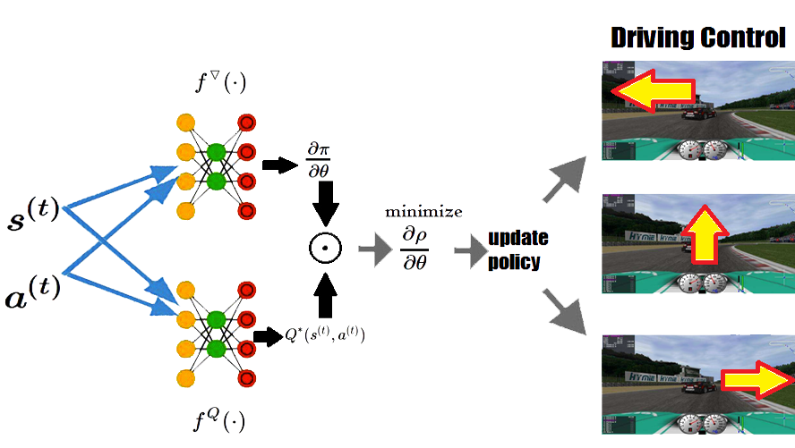
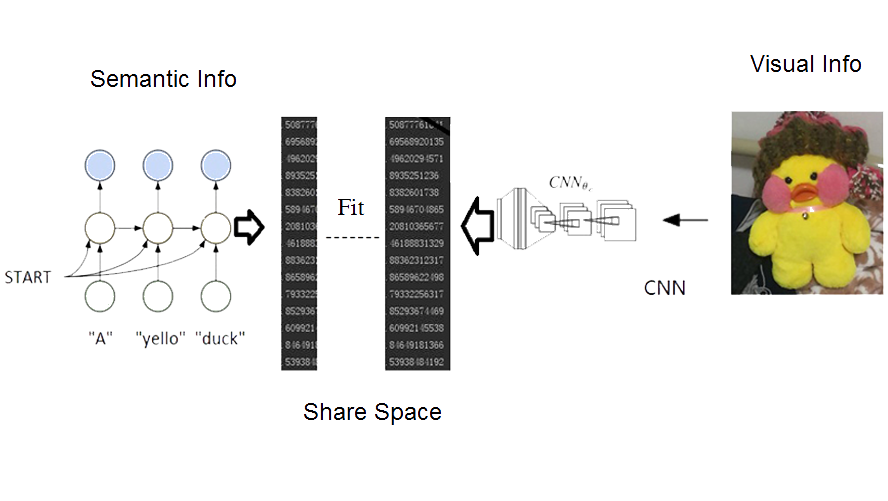
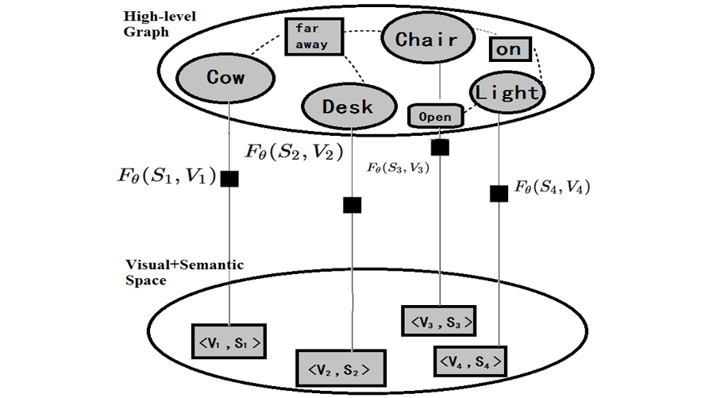

## Welcome: I'm Mincong Luo 

I am now a PhD candidate in [State Key Laboratory of Information Security](http://www.sklois.cn/), my major is Network Security.

This is the details of my research experience, with my research experience and papers, code, and handout details:

-------------------------------------------

My paper:
**Traffic Route Planning in Partially Observable Enviroment Using Actions Group Representation**
has been ACCEPTED as a SRC Program Paper by **The 14th International Conference on Knowledge Science, Engineering and Management(KSEM 2021)**(2021.06);

My paper:
**Implementing Inductive Logic into Embedded Industrial Control System with Polynomial Ring on F2**
has been ACCEPTED as a SRC Program Paper by **2021 IEEE 45th Annual Computers, Software, and Applications Conference (COMPSAC)**(2021.05);

My paper:
**Fuzzy World:A Tool Training Agent from Concept Cognitive to Logic Inference**
has been ACCEPTED by **Pacific-Asia Conference on Knowledge Discovery and Data Mining 2021**(2021.02);

My new draft paper:
[Polynomial Semantic Representation](https://luomin1993.github.io/
Polynomial_Semantic_Representation.pdf)

My paper:
**Automatic Derivation of Formulas by Graph Embedding and Pattern Matching Network**
has been ACCEPTED as a SRC Program Paper by **34th ACM-SAC**(2018.12);

My paper:
**Generative Model for Material Experiments Based on Prior Knowledge and Attention Mechanism**
has been ACCEPTED as a workshop paper by **NIPS2018**(2018.11);

My paper:
**Orthogonal Policy Gradient and Autonomous Driving Application**
has been ACCEPTED by **IEEE/ICSESS**(2018.10);

I was elected as a **REVIEWER** for the ICIAI 2019 - ACM, ISBN: 978-1-4503-6128-6(2018.10);

-------------------------------------------
### Professional Experience(我的科研經歷)

-   CSA: PhD student(2019.9-NOW)

>My work in SKLOIS is about: Algebra-based intelligent language processing (Algebraic method)
 

-   CSA: Intern Algorithm Researcher(2018.5-2019.05)

>My work in CSA motivated by:logical reasoning combined with vision and semantics (Explainable AI)

-------------------------------------------
### My Research Interests(我的科研興趣)
- AI algorithm in scientific research field(Algebraic method).
- Robotic virtual environment and visual semantic fusion algorithm(Algebraic method).
- Quantitative trading implementation and algorithms(Algebraic method).

--------------------------------------------
### Progress of My Reasearch(我的科研進展)

##### Orthogonal Policy Gradient and Autonomous Driving Application
we present an approach called orthogonal policy gradient descent(OPGD) that can make agent learn the policy gradient based on the current state and the actions set, by which the agent can learn a policy network with generalization capability. 

##### Visual Semantic Space
The information of images is disorganized and with noise, but language is high-level organized and abstract. In this research we try to find a share space between visual and semantic.

##### Reasoning Based on Visual Semantic
One less aspect of neural representation learning is short of logic-reasoning ability, in this research we map the embedding space with visual and semantic information to a logic graph space for reasoning tasks.

-------------------------------------------
### More Details About Me

- **My GitHub** :https://github.com/Luomin1993
- **My Blog** :https://blog.csdn.net/hanss2

