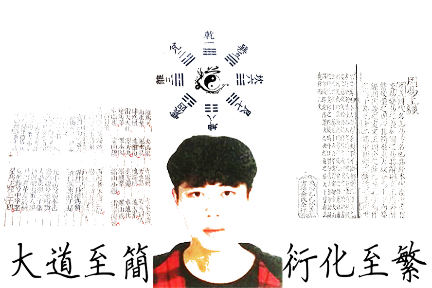

## Welcome: I'm Mincong Luo 

I am now a postgraduate student in mainland of [M-C group of CIAE](https://luomin1993.github.io/CIAE_MC/), my major is Applied Mathematics.

This is the details of my research experience, with my research experience and papers, code, and handout details:

#### [My Papers And Code(點擊查看下载我的論文、講義及其代碼)](https://github.com/Luomin1993/Luomin1993.github.io/raw/master/My_CV.pdf)

-------------------------------------------

 My paper:
**Generative Model for Material Experiments Based on Prior Knowledge and Attention Mechanism**
has been ACCEPTED as a workshop paper by **NIPS2018**  !!!

 My paper:
**Orthogonal Policy Gradient and Autonomous Driving Application**
has been ACCEPTED by **IEEE/ICSESS** !

 I was elected as a **REVIEWER** for the ICIAI 2019 - ACM, ISBN: 978-1-4503-6128-6,Welcome Submissions!

-------------------------------------------
### Professional Experience(工作經歷)

-   Sougou: Intern Algorithm Engineer(2017.10-2018.2)

>My work in Sougou motivated by:machine learning for risk assessment in **stock market/futures/foreign exchange** trading.

-   Sina WeiBo: Intern Algorithm Engineer(2018.2-2018.5)

>My work in Sina motivated by:reinforcement learning for automatic symbolic computation

-   CSA: Intern Algorithm Researcher(2018.5-NOW)

>My work in CSA motivated by:logical reasoning combined with vision and semantics (Explainable AI)

-------------------------------------------
### My Research Interests
- AI algorithm in scientific research field (automatic formula derivation, semantic understanding).
- Robotic virtual environment and visual semantic fusion algorithm.
- Quantitative trading implementation and algorithms.

-------------------------------------------
### About Me

- [**Dowload My CV**](https://github.com/Luomin1993/Luomin1993.github.io/raw/master/My_CV.pdf)
- [**Dowload My Ph.D Plan**](https://github.com/Luomin1993/Luomin1993.github.io/raw/master/My_Phd_plan.pdf)
- **My GitHub** :https://github.com/Luomin1993
- **My Blog** :https://blog.csdn.net/hanss2

